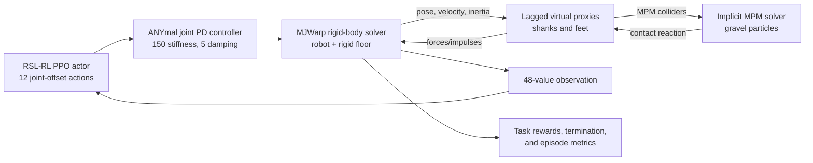

# Compliant Surface Locomotion: Technical Report

## 1. Project overview

This repository is a focused research prototype for training and evaluating an
ANYmal-C quadruped on a deformable gravel pavement. It combines:

- [Isaac Lab](https://github.com/isaac-sim/IsaacLab) for scene construction and
  the direct reinforcement-learning environment;
- [Newton](https://github.com/newton-physics/newton) as the kit-less GPU physics
  backend;
- MuJoCo Warp (MJWarp) for articulated rigid-body dynamics;
- Newton's implicit Material Point Method (MPM) solver for the gravel; and
- [RSL-RL](https://github.com/leggedrobotics/rsl_rl) for PPO training.

The task is deliberately finite rather than treadmill-like: the robot starts
near one end of a 3 m long pavement, travels approximately 2 m in the world
positive-X direction, and must come to rest near the far end while remaining on
the pavement and upright.

This is not currently a general-purpose Python package. It is a small collection
of executable scripts, with Isaac Lab installed separately into the repository's
`uv` virtual environment.

### Repository map

| Path | Purpose |
| --- | --- |
| [`README.md`](../README.md) | Installation and common commands. |
| [`scripts/gravel_coupling.py`](../scripts/gravel_coupling.py) | Shared rigid-body/MPM physics configuration and Isaac Lab coupling fixes. |
| [`scripts/train_anymal.py`](../scripts/train_anymal.py) | Direct Isaac Lab environment, task, rewards, PPO configuration, rigid-policy transfer, and training entry point. |
| [`scripts/view_anymal_policy.py`](../scripts/view_anymal_policy.py) | Playback of either Newton's original rigid-floor policy or a trained RSL-RL checkpoint. |
| [`scripts/view_anymal.py`](../scripts/view_anymal.py) | Lower-level standing/physics diagnostic with many coupling controls exposed. |
| [`scripts/verify_isaaclab.py`](../scripts/verify_isaaclab.py) | Import smoke test for the separately installed Isaac Lab components. |

## 2. End-to-end architecture

The simulation is split between two solvers and coordinated by Newton's virtual
proxy coupler:



The MPM bed is therefore not a visual effect and the coupling is not one-way.
The robot deforms and displaces the particles, while the particle contact
reaction changes the robot's rigid-body motion. The proxy configuration happens
to name the rigid solver as `source` and MPM as `destination`, but the coupled
solve returns the reaction to the source rigid bodies.

## 3. Rigid-body/MPM coupling in detail

### 3.1 Solver ownership

`gravel_physics_cfg()` creates a `CouplerProxyCfg` with two entries:

1. **`robot` — MJWarp rigid-body entry**
   - Owns the robot bodies and rigid floor shapes.
   - Uses Newton constraints inside `MJWarpSolverCfg`.
   - Defaults to one rigid substep.
   - Raises contact capacities to `njmax=400` and `nconmax=1000` for the larger
     Isaac Lab scene.
   - Uses 50 linear-solver iterations.

2. **`gravel` — implicit MPM entry**
   - Owns all particles and steps them in place, as required by the coupler.
   - Uses the sparse background grid by default.
   - Uses PIC transfer, a `P0` strain basis, up to 50 nonlinear iterations, and
     tolerance `1e-6`.
   - Uses `collider_velocity_mode="forward"`; the comments record that the
     backward mode injected energy into the surface.
   - Does not separately own the floor. MPM considers model shapes as particle
     colliders even when their rigid ownership belongs to the other entry, and a
     shape cannot be owned by both entries.

The default proxy mapping exposes only bodies whose labels end in `SHANK` or
`FOOT`. This mirrors the intent of Newton's standalone ANYmal/MPM example and
avoids coupling every robot link to the particles. It uses:

- lagged proxy mode;
- proxy mass scale 1.0;
- one coupler relaxation pass; and
- no separate collision pipeline on the MPM destination, because the MPM solver
  resolves its own collider contacts.

In lagged mode, the MPM contact calculation uses proxy state transferred from
the rigid system and feeds its result back through the coupled step. This is an
operator-split approximation, so time step, effective inertia, contact mode, and
material stiffness all affect stability.

### 3.2 Isaac Lab integration fixes

`NewtonMPMCouplerManager` supplies three pieces that the stock coupled path did
not provide at the Isaac Lab/Newton revisions used during development:

1. **Run MPM builder hooks.** `MPMObject` registers particle emission through
   per-world builder hooks. The inherited deformable/VBD coupler path did not run
   them, producing an empty bed without an error. The custom manager delegates to
   the base Newton builder path so the particles enter the model.

2. **Refresh MPM colliders after proxy installation.** The implicit MPM solver
   initially rasterizes colliders before the coupler has installed proxy bodies
   and their articulated effective inertia. The custom manager calls
   `setup_collider()` again after solver construction.

3. **Use MPM-compatible reset behavior.** The solver-internal MPM reset rejected
   Isaac Lab's world mask in this coupled layout. The override skips that internal
   reset in the same spirit as Isaac Lab's standalone Newton MPM manager.

Each behavior has a toggle in `gravel_physics_cfg()` for diagnosing whether a
future upstream release has fixed the underlying issue. These workarounds use
private or version-sensitive implementation details, so they should be retested
whenever Isaac Lab or Newton is upgraded.

### 3.3 Gravel and container

Each default training environment contains a rectangular MPM volume:

| Parameter | Default |
| --- | ---: |
| Length | 3.0 m |
| Width | 1.5 m |
| Depth | 0.05 m |
| Voxel size | 0.03 m |
| Particles per cell | 3.0 |
| Particle jitter | 0.0075 m |
| Density | 2500 kg/m³ |
| Young's modulus | `1e10` Pa |
| Yield stress | `3e4` Pa |
| Yield pressure | `3e4` Pa |
| Viscosity | 0 Pa·s |
| Damping | 0.02 s |
| Internal friction | 0.8 |

At these settings, one pavement contains roughly 320,000 particles. A rigid slab
supports the particles from below, and four shallow rigid borders contain them.
The floor and borders use static and dynamic friction 0.9. The end goal is
mathematical rather than a scene object; there is intentionally no goal bar in
the gravel.

The material is a continuum approximation to yielding granular terrain, not a
discrete collection of individually modeled stones. Its parameters should be
read as effective simulation parameters unless calibrated against a physical
material.

## 4. Training script

### 4.1 Isaac Lab direct workflow

`AnymalGravelEnv` subclasses `DirectRLEnv` and implements the standard direct
workflow hooks:

- `_setup_scene()` obtains the articulation and MPM object handles;
- `_pre_physics_step()` clips and maps actions;
- `_apply_action()` sends joint-position targets;
- `_get_observations()` constructs the policy vector;
- `_get_rewards()` computes and logs reward terms;
- `_get_dones()` evaluates success and failures; and
- `_reset_idx()` logs episode outcomes and restores robot state.

The simulator runs at 200 Hz (`dt=0.005 s`). An action is held for four physics
steps, so the policy and task run at 50 Hz (`step_dt=0.02 s`). The default
12-second episode is at most 600 policy steps.

Eight environments are laid out in parallel and cloned with replicated physics.
Their spacing is the larger of pavement length plus 1 m and pavement width plus
1 m, preventing adjacent containers from overlapping.

### 4.2 Start, goal, and command generation

For the default 3 m pavement:

- spawn X is `-0.9 m` (`-length/2 + 0.6 m`);
- goal X is `+1.1 m` (`+length/2 - 0.4 m`); and
- required net travel is therefore approximately 2.0 m.

The policy receives the same three command channels as the source walking
policy: forward speed, lateral speed, and yaw rate. The desired forward speed is
0.7 m/s while far from the goal and decreases linearly over the last 0.65 m. The
lateral and yaw commands steer back toward the pavement center and goal heading,
with conservative clamps.

### 4.3 Observation and action contract

The 48-value observation is kept exactly compatible with Newton's pretrained
rigid-floor actor:

| Values | Quantity |
| ---: | --- |
| 3 | Base linear velocity in the body frame |
| 3 | Base angular velocity in the body frame |
| 3 | Gravity projected into the body frame |
| 3 | Forward/lateral/yaw velocity command |
| 12 | Joint-position offsets from the default pose |
| 12 | Joint velocities |
| 12 | Previous policy actions |

The actor returns 12 normalized joint-offset actions. They are clipped to
`[-1, 1]`, reordered from the pretrained policy's explicit joint order into the
articulation's joint order, multiplied by 0.5 rad, and added to the default joint
pose. An implicit joint-space PD actuator tracks those targets with stiffness
150, damping 5, and armature 0.06 kg·m².

The joint remapping is load-bearing: asset joint order and source policy order
are not assumed to match. The script validates that every expected joint exists
and builds mappings in both directions.

### 4.4 Transfer-only initialization

A fresh run always starts from Newton's pretrained rigid-floor ANYmal-C actor.
The default policy is downloaded/resolved from Newton's `anybotics_anymal_c`
asset cache as `rl_policies/anymal_walking_policy_physx.pt`. A custom file can be
selected with `--pretrained-policy`. Newton's
[ANYmal-C walking example](https://github.com/newton-physics/newton/blob/main/newton/examples/robot/example_robot_anymal_c_walk.py)
shows the rigid-floor application from which this locomotion prior was identified.

The target actor architecture is fixed at `48 → 128 → 128 → 128 → 12` with ELU
activations and no actor observation normalization. The script copies the four
linear layers from the TorchScript actor into RSL-RL, then compares source and
target output on a deterministic test observation. Training aborts if the maximum
action mismatch exceeds `1e-5`.

Only the actor is transferred. The critic starts from a new
`256 → 256 → 128 → 1` network with observation normalization. Exploration starts
with action standard deviation 0.25, and the PPO learning rate is reduced to
`1e-4` to avoid quickly destroying the useful walking gait.

`--resume` is different from fresh transfer: it restores an RSL-RL checkpoint,
including its learned actor, critic, optimizer, and associated runner state,
rather than copying the original rigid policy again.

The source policy and this task must continue to agree on observation order,
joint order, action scale, actuator gains, and network shape. A mismatch in any
of these can look like a physics or learning failure even when the weights copy
successfully.

### 4.5 PPO configuration and training volume

The important PPO defaults are:

| Parameter | Value |
| --- | ---: |
| Environments | 8 |
| Steps per environment per update | 96 |
| Samples per update | 768 |
| Learning epochs | 5 |
| Mini-batches | 4 |
| Discount `gamma` | 0.99 |
| GAE `lambda` | 0.95 |
| PPO clip | 0.2 |
| Entropy coefficient | 0.005 |
| Desired KL | 0.01 |
| Max gradient norm | 1.0 |
| Checkpoint interval | 50 iterations |

The 96-step rollout covers 1.92 seconds per environment. A 5,000-iteration run
collects 3.84 million policy transitions, equivalent to 15.36 million aggregate
physics steps. Iteration count is therefore meaningful only together with
`num_envs` and `num_steps_per_env`.

### 4.6 Reward function

The reward is the sum below. Terms marked “per second” are multiplied by the
policy time step; world progress is an incremental potential term and terminal
terms occur once.

| Term | Definition and intent |
| --- | --- |
| World progress | `12 × clamp(x_t - x_(t-1), -0.05, 0.05)`. Dominant net world-frame progress; approximately +24 for the default 2 m traversal. |
| Velocity error | `-((v_x - v_target)² + v_y²)` per second. Tracks the slowing speed command without rewarding oscillatory body-frame velocity. |
| Orientation error | `-2 × (g_body,x² + g_body,y²)` per second. Penalizes `sin²(tilt)` and remains sensitive close to upright. |
| Goal stop | `+2 × exp(-speed² / 0.05)` per second while near the goal and centerline. |
| Lateral error | `-0.6 × y²` per second. |
| Heading error | `-0.3 × normalized_goal_lateral²` per second. |
| Vertical velocity | `-1.5 × v_z²` per second. |
| Roll/pitch angular velocity | `-0.05 × (ω_x² + ω_y²)` per second. |
| Torque | `-2.5e-5 × Στ²` per second. |
| Joint acceleration | `-2.5e-7 × Σq̈²` per second. |
| Action rate | `-0.01 × Σ(a_t - a_(t-1))²` per second. |
| Overshoot | `-6 × max(-remaining_x, 0)²` per second. |
| Failure | `-10` on non-success termination. |
| Success | `+20` on successful termination. |

Non-finite reward components are replaced by a finite penalty before summation.
This prevents a single unstable contact from poisoning a PPO batch with NaNs.

World-frame displacement is intentionally the main positive shaping signal. A
positive reward based only on instantaneous or body-frame forward velocity can
be exploited by rocking or stepping in place. Reward rates are logged per
episode-second so surviving longer does not automatically make a per-step term
look better in TensorBoard.

### 4.7 Success, failure, and reset

Success requires all of the following continuously for 0.4 seconds:

- absolute longitudinal goal error below 0.12 m;
- absolute lateral error below 0.18 m;
- base linear speed below 0.12 m/s;
- base angular speed below 0.25 rad/s; and
- upright cosine above 0.8.

An episode terminates early if the robot succeeds, base height falls below the
gravel depth plus 0.30 m (0.35 m by default), upright cosine falls below 0.45,
the base's lateral error exceeds half the pavement width plus 0.25 m, it
overshoots the goal by more than 0.35 m, or any important rigid state becomes
non-finite. It also ends at the 12-second time limit.

Reset restores the nominal robot pose and zero velocity, adds small joint and XY
position noise during training, and clears task history. Playback disables that
noise. PPO does not randomize initial episode length because every rollout is
meant to preserve the entrance-to-goal structure of the task.

## 5. Outputs, monitoring, and playback

Every training run creates a timestamped directory below
`logs/rsl_rl/anymal_gravel/` containing:

- RSL-RL checkpoints (`model_<iteration>.pt`);
- TensorBoard event files;
- `task_args.yaml`, the command-line settings;
- `env_cfg.yaml`, the resolved environment configuration; and
- `agent_cfg.yaml`, the resolved PPO configuration.

The runner also asks RSL-RL to record the Git repository state. To inspect a run:

```bash
uv run tensorboard --logdir logs/rsl_rl/anymal_gravel
```

Useful tags include:

- `Metrics/success_rate`;
- `Metrics/net_forward_distance`;
- `Metrics/mean_world_forward_velocity`;
- `Metrics/goal_region_entry_rate`;
- `Metrics/final_abs_goal_error` and `final_abs_lateral_error`;
- `Metrics/final_base_height` and `final_upright`;
- `Episode_Reward/<term>` for each reward component; and
- `Termination/<reason>` for failure-mode diagnosis.

The metrics are emitted when environments reset, not on every physics step.
Short windows can consequently look sparse or noisy. Reward-component plots are
rates, and larger is better even for penalty tags: an orientation error rising
toward zero means the robot is becoming more upright.

`view_anymal_policy.py` uses one environment and supports three useful modes:

```bash
# Inspect the source rigid-floor policy directly on gravel.
uv run python scripts/view_anymal_policy.py --pretrained

# View the newest saved trained checkpoint.
uv run python scripts/view_anymal_policy.py

# Reproducibly select a particular checkpoint.
uv run python scripts/view_anymal_policy.py \
  --checkpoint logs/rsl_rl/anymal_gravel/RUN/model_4999.pt
```

For a trained checkpoint, playback reads `task_args.yaml` beside the model and
recreates its pavement geometry and timing unless an explicit CLI override is
given. Direct `--pretrained` playback has no saved task file and uses current
defaults. At each episode end, playback prints termination cause, success,
distance, goal error, base height, and upright value.

## 6. Recommended workflow

After following the installation steps in the README:

```bash
# 1. Verify the external Isaac Lab installation.
uv run python scripts/verify_isaaclab.py

# 2. Check the rigid source policy in the coupled gravel scene.
uv run python scripts/view_anymal_policy.py --pretrained

# 3. Fine-tune for an initial 5,000-iteration budget.
uv run python scripts/train_anymal.py \
  --max-iterations 5000 \
  --num-envs 8 \
  --num-steps-per-env 96 \
  --run-name upright_reward_v1

# 4. Monitor learning in another terminal.
uv run tensorboard --logdir logs/rsl_rl/anymal_gravel

# 5. Play a selected checkpoint rather than relying on newest-file selection.
uv run python scripts/view_anymal_policy.py --checkpoint PATH_TO_MODEL
```

Five thousand iterations is an experiment budget, not a convergence guarantee.
Checkpoint playback and success-rate/failure-mode plots should decide whether to
continue. To add another 1,000 updates:

```bash
uv run python scripts/train_anymal.py \
  --resume PATH_TO_MODEL \
  --max-iterations 1000 \
  --run-name upright_reward_v1_resume
```

## 7. Important learnings

### Coupling correctness comes before policy optimization

An empty bed, a stale collider rasterization, an invalid reset path, or unstable
proxy feedback can all masquerade as a poor reward function. The lower-level
standing diagnostic and the custom coupler manager were necessary to establish a
credible physics loop before training.

### The coupling defaults are load-bearing

The code records three particularly important choices:

- lagged proxy transfer;
- forward MPM collider velocity; and
- nonzero shear strength in the gravel material.

Changing any one independently caused loss of support or instability during the
project's diagnostic experiments. The 0.06 kg·m² joint armature, matched to the
Newton reference example, was also important; zero armature made the articulated
feet too responsive to one-step-lagged feedback from the stiff bed.

### A floor is still required under an MPM bed

The particles are subject to gravity. Without the explicit supporting slab the
entire bed falls, taking away the surface the robot is meant to traverse. One
floor can support both systems even though it is owned by only one coupled-solver
entry.

### Granular support depends on shear behavior

Making a material difficult to compress is not enough to carry a quadruped. The
effective yield stress, plastic response, and contact friction determine whether
the bed resists foot shear or flows away. The current values are stable operating
parameters, not yet a validated model of a named gravel grade.

### From-scratch PPO found a poor local behavior

Earlier from-scratch experiments produced dramatic in-place motion and only
about 0.7 m of net progress before plateauing. Making net world progress dominant
and increasing the rollout from 24 to 96 steps improved the learning signal but
did not by itself produce a reliable crossing gait. Initializing from an existing
rigid-floor walking actor provided a useful locomotion prior and worked much
better. The training entry point is now intentionally transfer-only.

### Transfer requires an exact interface, not merely similar observations

The useful prior survived because network shape, observation order, joint order,
action scale, actuator gains, and command semantics were matched explicitly. The
output parity check catches weight-copy errors, while the explicit joint maps
catch asset-order errors.

### Net progress and rate-normalized logs reduce reward ambiguity

The telescoping X-displacement term rewards actual movement through the world,
not periodic velocity. Logging per-second reward rates avoids the misleading
appearance that an episode is improving merely because it remains alive longer.
Task-level metrics such as distance, goal entry, success, and termination reason
are more interpretable than total return alone.

### Upright shaping must remain sensitive near the desired pose

The current `sin²(tilt)` penalty has a useful gradient near upright. The earlier
`(1 - cos(tilt))²` form became fourth-order for small tilt and was too weak to
discourage a dramatic gait close to nominal orientation.

## 8. Caveats and limitations

1. **This is fine-tuning, not learning locomotion from scratch.** Every fresh run
   inherits a rigid-floor walking policy. Results demonstrate adaptation of an
   existing gait to gravel, not independent discovery of quadruped locomotion.

2. **Upstream APIs are moving.** Isaac Lab is installed from its `develop`
   branch and is not represented as a locked dependency in `uv.lock`. The custom
   manager and actor copier access version-sensitive internals. Reproducibility
   requires recording the exact Isaac Lab, Newton, and RSL-RL revisions in
   addition to the saved YAML and Git state.

3. **A plain `uv sync` can remove Isaac Lab.** Because Isaac Lab is installed
   separately, use `uv sync --inexact` after setup or reinstall the kit-less
   extras as described in the README.

4. **The model is expensive.** Roughly 320,000 particles per pavement makes eight
   environments a substantial GPU workload. Raising environment count, reducing
   voxel size, widening/deepening the bed, or increasing particles per cell can
   increase memory and runtime sharply.

5. **The terrain distribution is narrow.** Training uses one flat rectangular
   pavement, fixed material parameters, fixed gravity, and small reset noise.
   There is no material/geometry domain randomization, curriculum, external
   pushes, actuator latency, sensor noise, or sim-to-real calibration. Robustness
   outside this scene is unproven.

6. **Only shanks and feet are MPM proxies.** This is efficient and matches the
   reference setup, but particle interaction with other robot links during an
   unusual fall is not modeled in the same way.

7. **The gravel is a continuum model.** It does not represent individual rock
   shape, rolling, interlocking, or size distribution. Visual realism should not
   be confused with validated terramechanics.

8. **Training is not deterministic.** CUDA simulation, TF32, stochastic policy
   sampling, and nondeterministic cuDNN settings mean the same seed does not
   guarantee identical learning curves. Important conclusions should be based on
   multiple seeds.

9. **Resume does not restore task arguments automatically.** Unlike playback,
   the training script does not read the original `task_args.yaml` when
   `--resume` is used. If a run used nondefault geometry, timing, particle, or
   speed settings, repeat those options when resuming.

10. **The newest-checkpoint heuristic is convenient, not canonical.** Playback
    prioritizes recent run/file modification times. Use `--checkpoint` for a
    reproducible evaluation.

11. **There is no automated behavioral test suite.** `verify_isaaclab.py` checks
    imports only. Headless standing, transfer initialization, checkpoint loading,
    finite-state playback, and task success should be added as version-gated
    regression tests where practical.

12. **Some diagnostic comments are historical.** The top-level documentation in
    `view_anymal.py` still describes an earlier NaN-on-contact investigation even
    though the current defaults include the armature and coupling choices derived
    from that work. Treat those notes as debugging history and revalidate the
    present configuration against current upstream revisions before drawing a
    stability conclusion. That diagnostic also has its own defaults (including a
    0.9 m pavement width rather than the training task's 1.5 m), and its `report()`
    function currently returns before printing, despite the README's headless
    telemetry description.

## 9. Suggested next steps

- Evaluate at least three random seeds and report median success rate, traversal
  time, final goal error, fall rate, and gait smoothness.
- Add a separate deterministic evaluation script that runs a fixed number of
  noise-free episodes and writes machine-readable summary statistics.
- Save or assert external dependency commit hashes with every run.
- Make training resume load and validate the original task configuration, with an
  explicit opt-in for overrides.
- Add controlled domain randomization for gravel strength, friction, depth,
  particle density, and pavement width after the single-condition task is stable.
- Compare the adapted checkpoint on rigid floor and gravel to quantify retention
  of the original gait and detect catastrophic forgetting.
- Add gait-quality metrics such as base roll/pitch RMS, foot slip, energy per
  meter, peak torque, action-rate RMS, and traversal time. These are more useful
  for judging “dramatic” motion than return alone.
- Periodically test whether upstream Isaac Lab has made the three custom coupling
  overrides unnecessary, then remove them one at a time with targeted regression
  checks.

## 10. Scope of conclusions

The repository demonstrates a practical route to adapting an existing ANYmal-C
walking policy to a two-way-coupled MPM surface inside Isaac Lab. Its strongest
contribution is the complete integration path: solver ownership, virtual proxies,
MPM material and container construction, version-specific coupling repairs,
policy-interface parity, task shaping, logging, and viewer-based evaluation.

It should be treated as a research baseline. A successful training curve or
viewer episode establishes behavior in this configured simulator; it does not by
itself establish robust granular locomotion, physical material fidelity, or
sim-to-real transfer.
